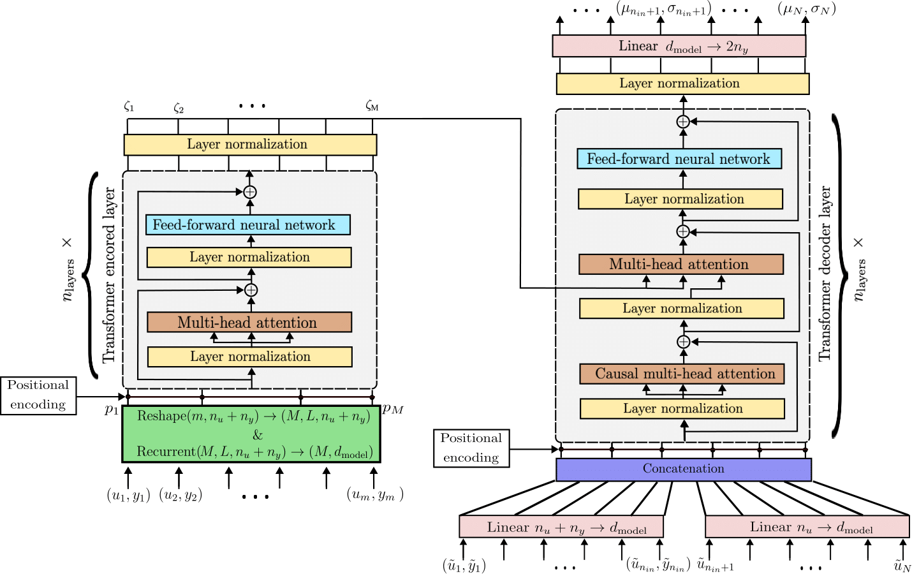

# In-context learning for model-free system identification

<!-- This repository contains the Python code to reproduce the results of the paper [In-context learning for model-free system identification](http://arxiv.org/abs/2308.13380)
by Matteo Rufolo, Dario Piga, Gabriele Maroni, Marco Forgione. -->

In this repository we extend the model-free in-context learning architecture introduced here [In-context learning for model-free system identification](http://arxiv.org/abs/2308.13380) for System Identification, where a *meta model* is trained to describe an entire class of dynamical systems.
We focus on three key innovations: formulating the learning task within a probabilistic framework; managing non-contiguous context and query windows; and integrating recurrent patching to effectively handle long context sequences.


## Multi-step-ahead model-free simulation

With respect to the original paper we analyze only a multi-step-ahead simulation, using an updated encoder-decoder (machine-translation-like) Transformer architecture:

<!--  -->


# Main files

The training are performed on the WH system class, and its script is:

* [train_sim_WH_skip.py](train_sim_WH_skip.py)

The script above accept command-line arguments to customize the architecture and aspects of the training. 
The goal of this repository is to extend the work presented in [sysid-transformer](https://github.com/forgi86/sysid-transformers) analyzing longer sequence (till 40'000 timestamps) using the patch approach:

 and obtaining not only point estimate of the future output but even a confidence of the prediction. 

Trained weights of all the Transformers discussed in the example section of the paper are available as assets in the [v0.1 Release](https://github.com/mattrufolo/sysid_prob_transformer/releases/tag/v0.1).


Jupyter notebooks that load the trained model and make predictions/simulations on new data are also available in the notebook file [test_sim_wh.ipynb](test_sim_wh.ipynb) 

# Software requirements
Experiments were performed on a Python 3.11 conda environment with:

 * numpy
 * scipy
 * pandas
 * matplotlib
 * tdqm
 * numba
 * pytorch (v2.2.2)

These dependencies may be installed through the commands:

```
conda install numpy scipy matplotlib tdqm numba pandas
conda install pytorch -c pytorch
```

For more details on pytorch installation options (e.g. support for CUDA acceleration), please refer to the official [installation instructions](https://pytorch.org/get-started/locally/).

The following packages are also useful:

```
conda install jupyter # (optional, to run the test jupyter notebooks)
pip install wandb # (optional, for experiment logging & monitoring)
```

# Hardware requirements
While all the scripts can run on CPU, execution may be frustratingly slow. For faster training, a GPU is highly recommended.
To run the paper's examples, we used a server equipped with an nVidia RTX 3090 GPU.


# Citing

If you find this project useful, we encourage you to:

* Star this repository :star: 


<!-- * Cite the [paper](https://arxiv.org/abs/2308.13380) 
```
@article{forgione2023from,
  author={Forgione, Marco and Pura, Filippo and Piga, Dario},
  journal={IEEE Control Systems Letters}, 
  title={From System Models to Class Models:
   An In-Context Learning Paradigm}, 
  year={2023},
  volume={7},
  number={},
  pages={3513-3518},
  doi={10.1109/LCSYS.2023.3335036}
}
``` -->
